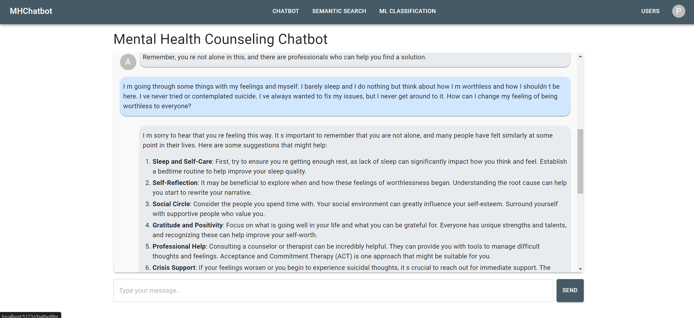
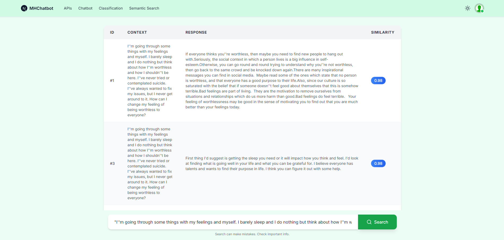
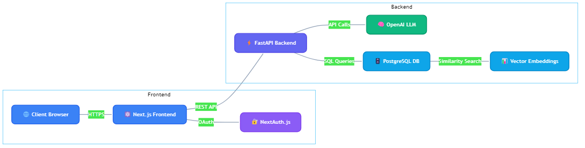

<div align="center">
  

# 🌟 Mental Health Counseling Chatbot 🌱

  <p style="font-size: 1.2em; color: #2E5C87; margin: 20px 0;">
    Empowering Minds, One Conversation at a Time
  </p>

  <p style="font-size: 1.1em; color: #486581;">
    An innovative AI-powered mental health support system crafted with Next.js 14 and FastAPI
  </p>

  <div style="margin: 35px 0; display: flex; flex-wrap: wrap; gap: 12px; justify-content: center;">
      
      
      
      
      
      
      
      
  </div>

  <div style="margin: 25px 0; display: flex; gap: 12px; justify-content: center;">
      
      <!--  -->
      
      
      <!--  -->
  </div>

</div>

---

## 🌺 Welcome to Your Digital Wellness Companion

In today's fast-paced world, mental health support should be accessible, understanding, and always available. Our Mental Health Counseling Chatbot combines cutting-edge AI technology with compassionate design to create a safe space for emotional support and personal growth.

### 🎯 Our Vision

We believe in making mental health support accessible to everyone, everywhere. Through advanced AI technologies and a thoughtfully crafted user experience, we provide:

- 🤝 Empathetic, judgment-free conversations
- 💡 Personalized coping strategies
- 🌈 Evidence-based emotional support
- 🎯 Goal-oriented personal growth guidance
- 🌟 24/7 availability for when you need support most

<!-- <div align="center">
  
</div> -->

## ✨ Key Features

### 🤖 AI-Powered Conversations

Our intelligent chatbot leverages state-of-the-art Large Language Models to deliver a transformative mental health support experience, combining natural, empathetic conversations perfectly tailored to individual needs with real-time emotional support and expert guidance. The system excels at providing personalized mental health resources and coping strategies while maintaining seamless conversation history tracking, all enhanced by sophisticated multi-turn contextual understanding that creates a truly connected and supportive environment for every user.

<div align="center">
  
  <p align="center"><em>Experience natural conversations with our AI-powered mental health companion</em></p>
</div>

### 🔍 Advanced Semantic Search

Our sophisticated semantic search engine harnesses cutting-edge natural language processing to deliver context-aware responses from verified mental health resources, demonstrating deep understanding of mental health terminology and concepts while intelligently matching user queries with relevant support materials. Through evidence-based recommendations from trusted sources and real-time information retrieval and synthesis, we ensure users receive comprehensive, reliable mental health guidance exactly when they need it.

<div align="center">
  
  <p align="center"><em>Discover relevant resources through our intelligent semantic search system</em></p>
</div>

<div align="center">
  <table>
    <tr>
      <td align="center">🎯 Precision</td>
      <td align="center">🔒 Security</td>
      <td align="center">⚡ Performance</td>
      <td align="center">🌐 Accessibility</td>
    </tr>
    <tr>
      <td>Accurate responses</td>
      <td>End-to-end encryption</td>
      <td>Lightning-fast results</td>
      <td>24/7 availability</td>
    </tr>
  </table>
</div>

## 🚀 Tech Stack

<div align="center">
  <div class="tech-grid" style="background: linear-gradient(135deg, #1a1a1a 0%, #2a2a2a 100%); padding: 2rem; border-radius: 16px; margin: 2rem 0;">
    <div class="row" style="display: grid; grid-template-columns: repeat(3, 1fr); gap: 2rem; margin-bottom: 2rem;">
      <!-- Frontend -->
      <div class="tech-card" style="background: rgba(255, 255, 255, 0.05); padding: 1.5rem; border-radius: 12px; text-align: center; transition: transform 0.3s;">
        
        <h3 style="color: #ffffff; margin: 1rem 0;">Next.js 14</h3>
        <p style="color: #a0aec0;">Powering Our Modern Frontend</p>
      </div>
      <!-- Backend -->
      <div class="tech-card" style="background: rgba(255, 255, 255, 0.05); padding: 1.5rem; border-radius: 12px; text-align: center;">
        
        <h3 style="color: #ffffff; margin: 1rem 0;">FastAPI</h3>
        <p style="color: #a0aec0;">High-Performance Backend</p>
      </div>
      <!-- Language -->
      <div class="tech-card" style="background: rgba(255, 255, 255, 0.05); padding: 1.5rem; border-radius: 12px; text-align: center;">
        
        <h3 style="color: #ffffff; margin: 1rem 0;">TypeScript</h3>
        <p style="color: #a0aec0;">Type-Safe Development</p>
      </div>
    </div>
    <div class="row" style="display: grid; grid-template-columns: repeat(3, 1fr); gap: 2rem;">
      <!-- Database -->
      <div class="tech-card" style="background: rgba(255, 255, 255, 0.05); padding: 1.5rem; border-radius: 12px; text-align: center;">
        
        <h3 style="color: #ffffff; margin: 1rem 0;">PostgreSQL</h3>
        <p style="color: #a0aec0;">Reliable Data Storage</p>
      </div>
      <!-- AI -->
      <div class="tech-card" style="background: rgba(255, 255, 255, 0.05); padding: 1.5rem; border-radius: 12px; text-align: center;">
        
        <h3 style="color: #ffffff; margin: 1rem 0;">OpenAI</h3>
        <p style="color: #a0aec0;">AI-Powered Intelligence</p>
      </div>
      <!-- Auth -->
      <div class="tech-card" style="background: rgba(255, 255, 255, 0.05); padding: 1.5rem; border-radius: 12px; text-align: center;">
        
        <h3 style="color: #ffffff; margin: 1rem 0;">NextAuth.js</h3>
        <p style="color: #a0aec0;">Secure Authentication</p>
      </div>
    </div>
  </div>
  <div style="text-align: center; margin-top: 2rem;">
    <p style="color: #4a5568; font-style: italic;">✨ Built with cutting-edge technologies for optimal performance and reliability ✨</p>
  </div>
</div>

### 🏗️ System Architecture

- Our chatbot runs on Next.js 14 frontend for smooth user experience, connects to FastAPI backend for quick processing, stores data safely in PostgreSQL, and leverages OpenAI for intelligent conversations - all working together seamlessly to provide mental health support!



<!-- mmdc -i diagram.mmd -o public/assets/diagram.png --backgroundColor transparent -w 1200 -->

## 🚀 Getting Started

### 1. Clone the Repository

Start by downloading the project repository to your local machine:

```bash
git clone https://github.com/yourusername/mhchatbot.git
cd mhchatbot
```

- This command clones the repository into a directory named mhchatbot and navigates into it.
- Ensure you have Git installed and configured before running this command.

### 2. Set Up Environment

Create a virtual environment to isolate your Python dependencies:

```bash
python3 -m venv venv
source venv/bin/activate  # For Windows: .\venv\Scripts\activate
```

- **Virtual Environments**: Using a virtual environment ensures that the dependencies for this project won’t interfere with other Python projects on your machine.
- **Activation**: Always activate the virtual environment before installing Python dependencies or running the project.

### 3. Install Dependencies

Install both `Node.js` and `Python` dependencies:

```bash
npm install
pip install -r requirements.txt
```

- Node.js Dependencies: `npm install` ensures that all required JavaScript libraries and frameworks are installed, particularly for the frontend and server-side integrations.
- Python Dependencies: `pip install -r requirements.txt` installs all the Python libraries specified in the `requirements.txt` file.

### 4. Configure Environment Variables

Set up the environment variables for your application:

1. Create a `.env` file in the root directory:

```bash
DATABASE_URL=your_postgresql_url
OPENAI_API_KEY=your_openai_key
NEXTAUTH_SECRET=your_secret
```

2. Alternatively, copy the example file and update it with your values:

```bash
cp .env.example .env
```

- Replace the placeholders (`your_postgresql_url`, `your_openai_key`, `your_secret`) with your actual values.

### 5. Initialize Database

Run the following command to apply the database migrations:

```bash
npx prisma migrate dev
```

- This command ensures that your database schema matches the models defined in your project.
- **Prisma**: Make sure Prisma CLI is installed as part of your Node.js dependencies.

### 6. Run the Application

- **Start the application in development mode**:

  ```bash
  npm run dev
  ```

  - This command launches the development server, typically accessible at `http://localhost:3000`.
  - The server automatically reloads whenever you make changes to the code, improving your development workflow.

- **Start the application in production mode**:

  ```bash
  npm run build
  npm run start
  ```

  - This command builds the production-ready version of your application and starts the server. Also available at `http://localhost:3000`.
  - The server is optimized for performance and security, making it suitable for production environments.

## 🌐 Deployment

### 1. Database Setup

- **Create a PostgreSQL Database**: Begin by setting up a reliable PostgreSQL database to store your application's data. Choose a cloud-hosted service like `AWS RDS`, `Heroku Postgres`, or `Supabase`, or deploy it on your own server if necessary. Make sure to define appropriate database schemas for your application.
- **Run Migrations to Create Tables**: Apply your database migrations to set up the tables and their relationships. This step ensures your database structure aligns with the application's requirements. Use tools like `knex.js`, `Prisma`, or `Sequelize` to manage these migrations efficiently and version control them to track changes.

### 2. Backend Deployment

- **Connect Your GitHub Repository**: Link your GitHub repository to the deployment platform (e.g., `Vercel`, `Netlify`, or `AWS Amplify`). This connection automates the process of pulling your application code whenever updates are made. Make sure your repository is structured and includes the necessary deployment scripts (like `package.json` for Node.js).
- **Configure Environment Variables**: Set up all required environment variables securely within the deployment platform. These include sensitive data like API keys, database credentials, and secret keys. Platforms like Vercel provide an interface for securely adding and managing environment variables.
- **Deploy with One Click Using Vercel**: With `Vercel`, you can deploy your backend effortlessly by clicking the "Deploy" button. Vercel will automatically build and deploy your project using its optimized serverless infrastructure. Ensure that the `vercel.json` configuration file (if required) is appropriately set up for any custom needs, such as routing or build commands.

### 3.Monitor and Scale

- **Use Vercel Analytics**: Leverage `Vercel`'s built-in analytics tools to track traffic, usage patterns, and performance metrics. This information helps identify bottlenecks, optimize user experience, and plan for future scaling.
- **Monitor API Performance**: Regularly monitor the performance of your API endpoints using tools like `Postman`, `New Relic`, or `Datadog`. Look for slow responses or high error rates and optimize your codebase or database queries as needed.
- **Scale Resources as Needed**: As your user base grows, adjust your backend resources. `Vercel`'s serverless architecture automatically scales based on demand, but ensure your database and any third-party services can handle the increased load. This might involve upgrading database plans, using caching (e.g., `Redis`), or distributing workloads across multiple instances.

### 4. Proxy Server Setup

- **Configure Nginx as Reverse Proxy**: Set up Nginx to handle incoming traffic and distribute it efficiently to your application servers. This adds an extra layer of security and improves performance through caching and load balancing.
- **SSL/TLS Configuration**: Implement HTTPS using Let's Encrypt certificates with Nginx. This ensures secure communication between clients and your servers while improving SEO rankings.
- **Load Balancing**: Configure Nginx load balancing for distributed deployments:

  ```nginx
  upstream backend {
      server backend1.example.com;
      server backend2.example.com;
      server backend3.example.com;
  }
  ```

  ```nginx
  user nginx;
  worker_processes auto;
  error_log /var/log/nginx/error.log warn;
  pid /var/run/nginx.pid;

  events {
      worker_connections 1024;
  }

  http {
      include /etc/nginx/mime.types;
      default_type application/octet-stream;

      # Logging settings
      log_format main '$remote_addr - $remote_user [$time_local] "$request" '
                      '$status $body_bytes_sent "$http_referer" '
                      '"$http_user_agent" "$http_x_forwarded_for"';
      access_log /var/log/nginx/access.log main;

      # Security headers
      add_header X-Frame-Options "SAMEORIGIN";
      add_header X-XSS-Protection "1; mode=block";
      add_header X-Content-Type-Options "nosniff";

      # SSL configuration
      ssl_protocols TLSv1.2 TLSv1.3;
      ssl_prefer_server_ciphers on;
      ssl_ciphers ECDHE-ECDSA-AES128-GCM-SHA256:ECDHE-RSA-AES128-GCM-SHA256;

      # Mental Health Chatbot server configuration
      server {
          listen 443 ssl;
          server_name your-domain.com;

          ssl_certificate /etc/letsencrypt/live/your-domain.com/fullchain.pem;
          ssl_certificate_key /etc/letsencrypt/live/your-domain.com/privkey.pem;

          # Rate limiting
          limit_req_zone $binary_remote_addr zone=one:10m rate=30r/m;
          limit_req zone=one burst=5;

          # Proxy settings
          location / {
              proxy_pass http://localhost:3000;
              proxy_http_version 1.1;
              proxy_set_header Upgrade $http_upgrade;
              proxy_set_header Connection 'upgrade';
              proxy_set_header Host $host;
              proxy_cache_bypass $http_upgrade;
              proxy_set_header X-Real-IP $remote_addr;
              proxy_set_header X-Forwarded-For $proxy_add_x_forwarded_for;
              proxy_set_header X-Forwarded-Proto $scheme;
          }

          # API endpoints
          location /api {
              proxy_pass http://localhost:3000;
              proxy_http_version 1.1;
              proxy_set_header Upgrade $http_upgrade;
              proxy_set_header Connection 'upgrade';
              proxy_set_header Host $host;
              proxy_cache_bypass $http_upgrade;
          }

          # Static files caching
          location /static {
              expires 30d;
              add_header Cache-Control "public, no-transform";
          }
      }
  }
  ```

  To implement this configuration:

  1. Save it to `/etc/nginx/nginx.conf`
  2. Replace `your-domain.com` with your actual domain
  3. Ensure SSL certificates are in place
  4. Test configuration: `nginx -t`
  5. Restart Nginx: `systemctl restart nginx`

## Learn More

To learn more about Next.js, take a look at the following resources:

- [Next.js Documentation](https://nextjs.org/docs) - learn about Next.js features and API.
- [Learn Next.js](https://nextjs.org/learn) - an interactive Next.js tutorial.
- [FastAPI Documentation](https://fastapi.tiangolo.com/) - learn about FastAPI features and API.

You can check out [the Next.js GitHub repository](https://github.com/vercel/next.js/) - your feedback and contributions are welcome!
